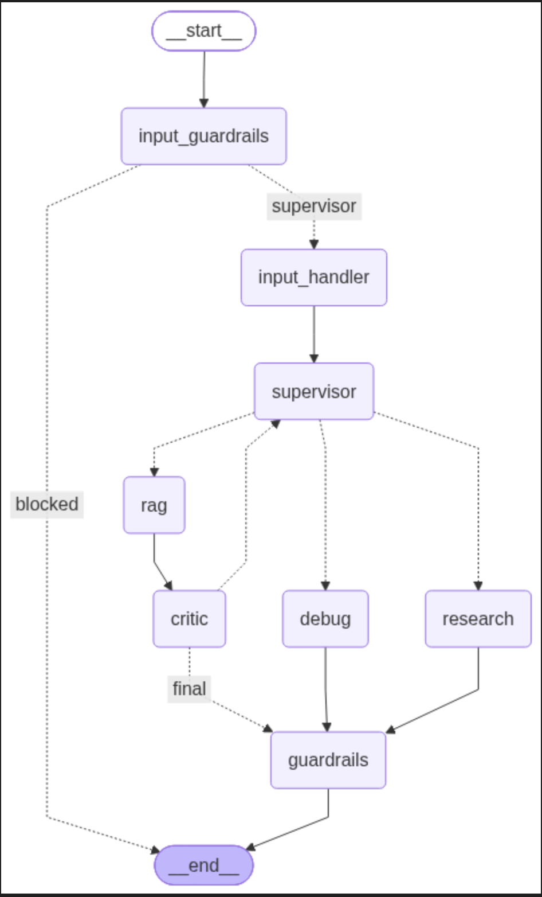

# 🤖 Agentic RAG Platform

A multi-agent **Agentic RAG system** built with **LangGraph, LangChain and Streamlit** that intelligently routes user requests across RAG, web research, debugging and conversational agents.

The system combines **hybrid retrieval, query analysis, query decomposition, tool calling, corrective RAG, multimodal inputs, guardrails, memory and LangSmith observability** into a single workflow.

---

## 🚀 Live Demo

👉 **Streamlit App:** https://multi-agentic-ai-rag-platform.streamlit.app

---

## 🏗️ Architecture
The system follows an adaptive workflow rather than a fixed RAG pipeline.

